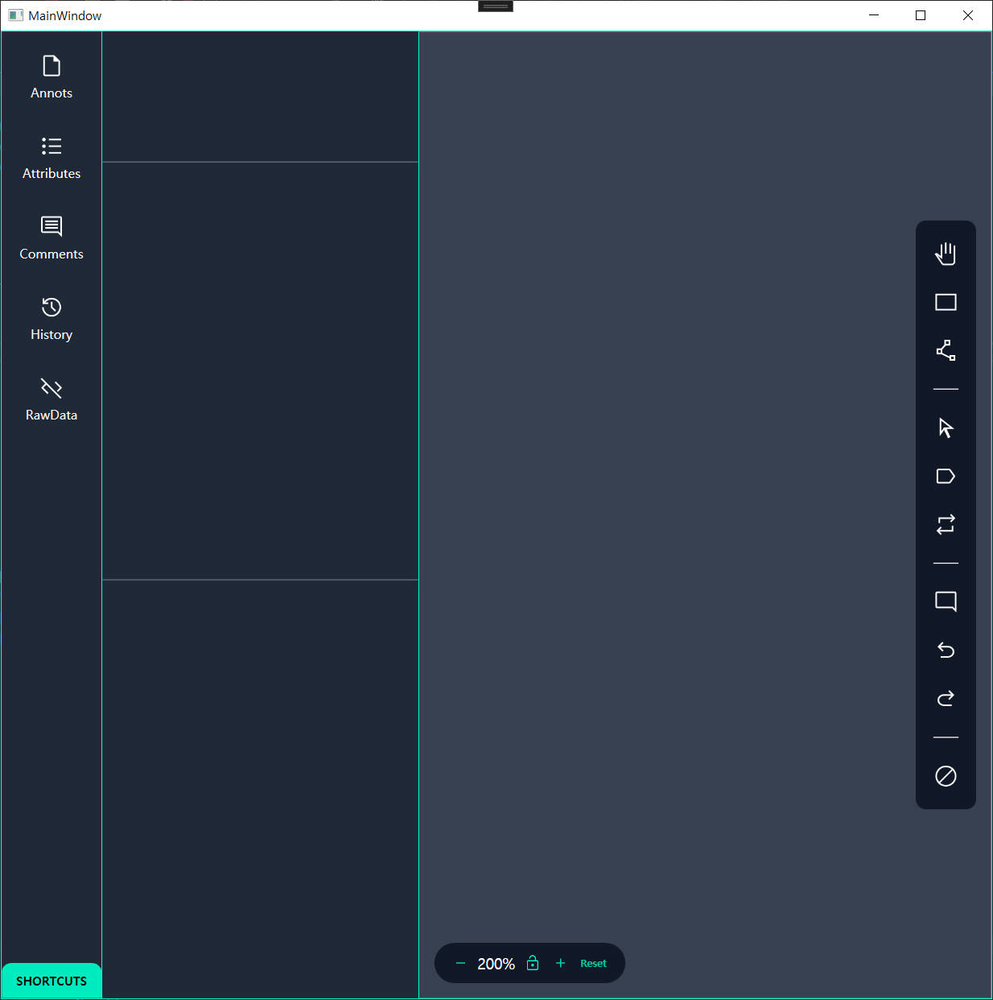
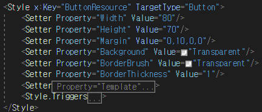

# 제목

 

## 실행화면

 

## MainWindow

1. Grid로 좌측과 우측을 나눈다. (좌측의 패널은 width : 415로 고정)

     

2. Grid 0번에 LefBar.xaml을 배치 시킨다. 

     

3. Grid 1번에 ControlPanel_Bottom과 ControlPanel_Right를 배치 시킨다. 

 

## 1. 컨트롤 패널 (하단) - ControlPanel_Bottom

 

## 2. 컨트롤 패널 (우측) - ControlPanel_Right

  좌측 그림은 마우스를 버튼에 올리기 전, 우측 그림은 버튼에 마우스를 올린 그림이다. 

### 2.1 코드 설명

 

1. 배경(Grid)는 투명으로 처리
2. 모서리를 둥글게 만들기 위해 Border에 CornerRadius 처리
3. StackPanel 내부에 10개 Button 배치
4. Border의 두께를 조절하여 나눔선 추가

 

 

1. 버튼들의 Style을 Resource화
2. 버튼과 이미지를 따로 조절하기 위해 Resource 분리

 

### <Button의 모서리를 둥글게 만드는 Code>
 

1. 모서리를 둥글게 만들기 위해서는 Template 속성을 이용해야한다. 
2. ControlTemplate의 TargetType는 Button으로 설정한다. 
3. TemplateBinding으로 '배경', '테두리', '테두리두께'를 Binding해준다. (하지 않으면 화면에 표시가 되지 않음)
4. Button 내부 Content인 Image를 화면에 띄워주기 위해 ContentPressenter를 사용한다. 

 

### <Button위에 마우스를 올렸을때 색을 변하게 하는 Code>
 

1. Style.Triggers에서 Trigger의 속성을 'IsMouseOver'로 설정하고, 값은 'True'로 설정한다. (마우스가 올라갔을때 True, 다시 나갔을때 False)
2. 값이 True일때만 적용 되는 스타일들을 Tirgger안에 적용시킨다.

 

## 3. 좌측Bar - LeftBar

### <LeftBar 화면>
 

 

### <LeftBar 구성>
  

1. Grid로 좌우를 나누어 좌측에는 버튼을 배치
2. 좌측 버튼을 눌렀을때 우측에는 UserInterface가 각각 출력 되도록 공간을 비워둠
3. StackPanel 안에 버튼을 배치함. 
4. 좌측 하단의 버튼은 맨 아래 위치를 해야 함으로 Stackpanel 밖에 배치하여 위치를 조정함. 

 

<Button Code 설명>

  

1. 각각의 버튼은 오른쪽 코드와 같다.
2. Button 내부에 StackPanel을 넣어 Image와 TextBox를 삽입한다.
3. Button, Image, TextBlock은 각각 Resource로 스타일을 정의한다. 

 

### <Resource 설명>

 

+ Image, TextBlock의 Resource는 속성값만 변경한 코드이기 때문에 설명 생략
1. Button Resource의 윗 부분은 속성값을 설정한다.
2. 아랫 부분의 2줄의 코드는 버튼의 모서리를 둥글게 만드는 코드와 버튼에 마우스가 올라갔을때 색상이 바뀌는 코드이다.

 

### <버튼의 테두리 둥글게 만드는 Code 설명>

 

1. 속성값은 Template으로 한다. 
2. ControlTemplate의 TargetType은 Button으로 한다.
3. TemplateBinding으로 버튼의 색, 테두리, 두께를 Binding해준다. (하지 않으면 출력이 되지 않음)
4. Button내부의 Image와 TextBlock을 출력하기 위해 ContentPresent설정을 해준다. (이것을 하지 않으면 테두리는 둥글게 보이지만 Image와 TextBlock이 보이지 않음)

 

### <버튼에 마우스를 올렸을때 색을 바꾸는 Code 설명>

 

1. Style.Trigger의 Trigger의 속성을 IsMouseOver로 설정하고 값은 True로 설정한다. (마우스가 버튼에 올라갔을때 True로 설정이 된다는 뜻이다.)
2. 값이 True일때 설정되는 속성을 Trigger안에 정의한다. 